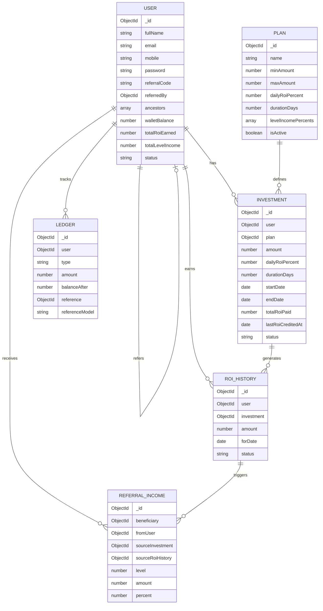

# Investment & Referral Platform

A full-stack MERN application for investment management with multi-level referral income tracking.

## Tech Stack

- **Backend**: Node.js, Express.js, MongoDB (Mongoose), JWT
- **Frontend**: React (Vite), Tailwind CSS, Recharts, Axios
- **Testing**: Jest, Supertest, mongodb-memory-server

## ER Diagram



## Setup

### Prerequisites

- Node.js >= 18
- MongoDB replica set (for transactions)
- npm or yarn

### Backend

```bash
cd backend
cp .env.example .env
# Edit .env with your MongoDB URI and secrets
npm install
npm run dev
```

### Frontend

```bash
cd frontend
npm install
npm run dev
```

### Environment Variables

| Variable | Description | Default |
|----------|-------------|---------|
| `NODE_ENV` | Environment | `development` |
| `PORT` | Server port | `5000` |
| `MONGODB_URI` | MongoDB connection string | `mongodb://localhost:27017/investment_platform` |
| `JWT_SECRET` | JWT signing secret | (required) |
| `JWT_EXPIRES_IN` | Access token expiry | `15m` |
| `JWT_REFRESH_SECRET` | Refresh token secret | (required) |
| `JWT_REFRESH_EXPIRES_IN` | Refresh token expiry | `7d` |
| `ROI_LEVELS` | Max referral levels | `5` |
| `CRON_TIMEZONE` | Cron job timezone | `UTC` |
| `CORS_ORIGIN` | Frontend URL | `http://localhost:5173` |

## API Reference

### Auth

#### POST /api/auth/register
```json
// Request
{
  "fullName": "John Doe",
  "email": "john@example.com",
  "mobile": "1234567890",
  "password": "password123",
  "referralCode": "OPTIONAL"
}

// Response (201)
{
  "success": true,
  "message": "Registration successful",
  "data": {
    "user": { ... },
    "accessToken": "eyJ...",
    "refreshToken": "eyJ..."
  }
}
```

#### POST /api/auth/login
```json
// Request
{
  "email": "john@example.com",
  "password": "password123"
}

// Response (200)
{
  "success": true,
  "message": "Login successful",
  "data": {
    "user": { ... },
    "accessToken": "eyJ...",
    "refreshToken": "eyJ..."
  }
}
```

#### GET /api/auth/me
Returns the authenticated user's profile.

### Investments

#### POST /api/investments
```json
// Request
{
  "planId": "64f5a1b2c3d4e5f6a7b8c9d0",
  "amount": 1000
}

// Response (201)
{
  "success": true,
  "message": "Investment created successfully",
  "data": {
    "_id": "...",
    "amount": 1000,
    "dailyRoiPercent": 1.5,
    "durationDays": 30,
    "status": "active"
  }
}
```

#### GET /api/investments?page=1&limit=10&status=active

### Dashboard

#### GET /api/dashboard/summary
```json
// Response
{
  "data": {
    "totalInvested": 5000,
    "activeInvestments": 3,
    "totalRoiEarned": 450,
    "totalLevelIncome": 120,
    "walletBalance": 5570,
    "todaysRoi": 15
  }
}
```

#### GET /api/dashboard/earnings-chart?days=30

### Referrals

#### GET /api/referrals/tree?depth=5
Returns nested referral tree built from materialized ancestors path.

#### GET /api/referrals/direct?page=1&limit=10

#### GET /api/referrals/income?page=1&limit=10

## Idempotency

ROI crediting is idempotent via the unique compound index `{investment: 1, forDate: 1}` on `RoiHistory`. If the cron job runs twice for the same date, the second run will hit a duplicate-key error and skip that investment.

Level income is idempotent via the unique compound index `{sourceRoiHistory: 1, beneficiary: 1}` on `ReferralIncome`.

The distributed lock (`JobLock` collection with TTL) is an optimization to prevent multiple app instances from running concurrently, but the unique indexes are the real safety net.

## Cron Job

Runs at `0 0 * * *` (midnight UTC daily).

### Manual Execution

```bash
npm run cron:roi -- --date=2026-08-01
```

### Catch-up Logic

On boot, the server processes any missed dates since the last `lastRoiCreditedAt` across all investments.

## Assumptions

1. ROI accrues daily on principal, not compounded; principal is not returned at maturity.
2. Level income is paid on the ROI amount, 5 levels deep, at 10/5/3/2/1%.
3. Level income requires the beneficiary to have at least one active investment.
4. Beneficiaries with `blocked` status are skipped for level income.
5. Wallet is internal ledger money; deposits/withdrawals are out of scope.
6. MongoDB runs as a replica set for transaction support.
7. All dates are stored in UTC.
8. Server timezone for cron is UTC (configurable via `CRON_TIMEZONE`).

## Running Tests

```bash
cd backend
npm test
```

## License

MIT
